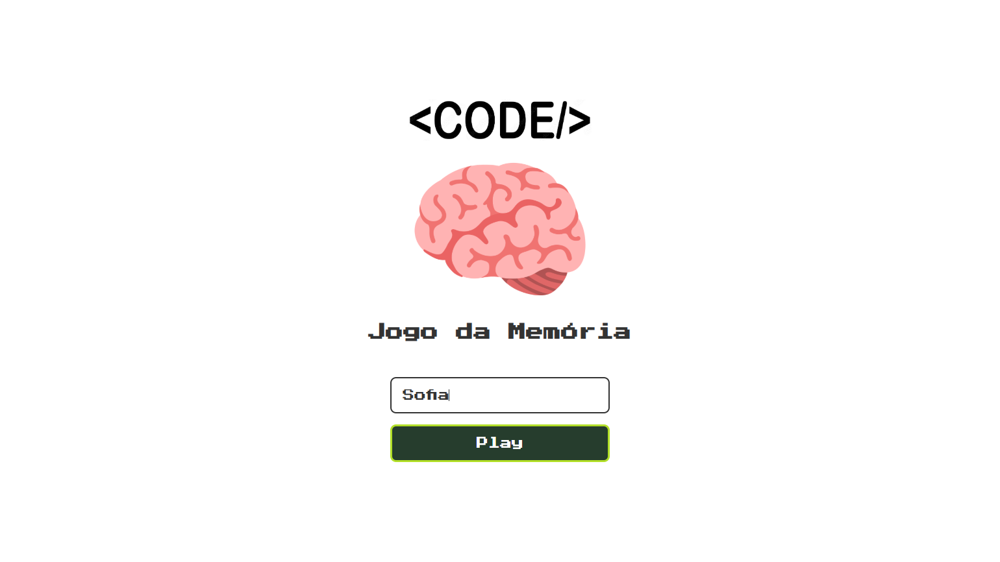
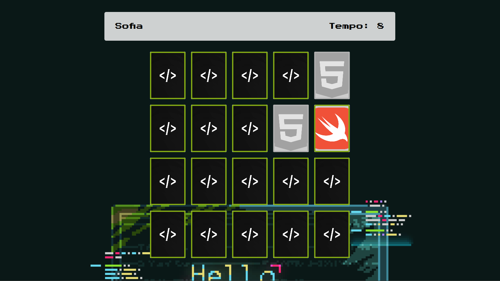

# 🎮 Jogo da Memória - CODE

Um projeto simples e divertido de Jogo da Memória para praticar conceitos de front-end, como manipulação de DOM, eventos, grid layout e lógica em JavaScript.

## 🚀 Tecnologias usadas

- HTML
- CSS
- JavaScript

## 📸 Demonstração




## 🧩 Como jogar

- Clique em uma carta para revelá-la.
- Tente encontrar todas as combinações corretas.
- Complete o jogo no menor tempo possível!

## 🔥 Funcionalidades

- Contador de tempo.
- Feedback visual de acertos e erros.
- Mensagem de parabéns ao finalizar.
- Opção para jogar novamente.
- Layout responsivo para diferentes tamanhos de tela.

## 📁 Estrutura do projeto

```
/
├── index.html
├── css/
│   ├── ... (styles)
├── js/
│   ├── ... (scripts)
├── images/
│   ├── ... (imagens das cartas)
├── pages/
│   ├── game.html
```

## 🛠️ Como rodar localmente

1. Clone o repositório:
   ```bash
   git clone https://github.com/SofiaAraki/CODE.git
   ```
2. Acesse a pasta do projeto:
   ```bash
   cd CODE
   ```
3. Abra o arquivo `index.html` no seu navegador.

> Não é necessário instalar dependências!

## ✨ Personalização

- Você pode trocar as imagens das cartas na pasta `/images/`.
- Também pode alterar o fundo (`background`) em `game.css`.

Feito com 💚 por [Sofia Araki](https://github.com/SofiaAraki)
